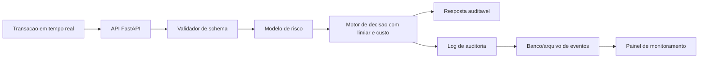

# Estrutura do Projeto Final — Detecção de Fraude (Trilha 1.2)

## 1) Objetivo do sistema
Construir um **agente de decisão de fraude em tempo real** que:
- recebe os dados de uma transação,
- calcula o risco de fraude,
- decide **fraude** ou **legítima** usando limiar justificado,
- retorna raciocínio auditável (score, limiar, fatores que influenciaram a decisão),
- registra logs para monitoramento e melhoria contínua.

---

## 2) Pergunta de negócio + custo dos erros

### Pergunta principal
"Dada uma transação, devemos bloquear/sinalizar como fraude ou liberar como legítima?"

### Erros e impacto
- **Falso Negativo (FN)**: fraude passa como legítima. Custo alto (chargeback, perda financeira, risco reputacional).
- **Falso Positivo (FP)**: transação legítima bloqueada. Custo moderado (fricção, abandono, suporte).

### Matriz de custo (definir no relatório)
Use uma matriz simples e transparente:
- Custo(FN) = 10x a 30x Custo(FP) (ajuste com hipótese de negócio explícita).

Exemplo para justificar no relatório:
- Custo(FP) = 1 unidade
- Custo(FN) = 20 unidades

### Função objetivo de decisão
Escolher limiar t que minimiza custo esperado no conjunto de validação:

Custo(t) = C_FN * FN(t) + C_FP * FP(t)

Opcionalmente, imponha restrição de operação:
- Recall >= 0.85 (exemplo), ou
- Precision >= 0.10 (exemplo para reduzir excesso de alertas)

---

## 3) Métricas corretas para base extremamente desbalanceada

## Métrica principal
- **PR-AUC** (mais informativa que ROC-AUC nesse cenário)

## Métricas de decisão operacional
- Precision
- Recall
- F1 ou F-beta (beta > 1 se priorizar recall)
- Matriz de confusão no limiar final
- Custo esperado no limiar final

## Métricas secundárias
- ROC-AUC (apenas complementar)
- Precision@K (se operação for por fila de revisão)

Importante: **não usar acurácia como métrica principal**.

---

## 4) Pipeline técnico (modelagem)

## 4.1 Preparação de dados
- Carregar creditcard.csv.
- Verificar classes: 492 fraudes em 284.807 transações.
- Features:
  - V1..V28 (PCA)
  - Time
  - Amount
  - Target: Class
- Escalonar Amount e Time (ex.: RobustScaler).

## 4.2 Particionamento
Como há coluna Time e dados de 2 dias, prefira split temporal para evitar leakage:
- treino: parte inicial
- validação: parte intermediária
- teste: parte final

Se usar split aleatório, justificar limitações.

## 4.3 Baselines e modelos candidatos
1. Baseline ingênuo (sempre legítima) para referência.
2. Regressão logística com class_weight='balanced'.
3. Árvores de boosting (XGBoost/LightGBM) com ajuste para desbalanceamento.

## 4.4 Tratamento de desbalanceamento
- class_weight
- scale_pos_weight (boosting)
- under/over-sampling apenas no treino (se usar, comparar com sem sampling)

## 4.5 Calibração de probabilidade
- CalibratedClassifierCV (Platt ou isotônico) para melhorar qualidade do score probabilístico.
- Avaliar Brier score e curva de calibração.

## 4.6 Escolha de limiar
Varrer t de 0 a 1 no conjunto de validação e calcular:
- precision(t), recall(t), Fbeta(t), custo(t)

Escolher t_final com justificativa:
- "Menor custo sujeito a recall mínimo" ou
- "Melhor equilíbrio operacional aprovado pelo stakeholder"

---

## 5) Agente auditável em tempo real

## Entrada da API
JSON da transação com campos:
- Time, Amount, V1..V28

## Saída da API
- decisão: fraude/legítima
- score_fraude (0-1)
- limiar_usado
- recomendação_operacional (bloquear, revisar, liberar)
- explicação_curta (fatores mais relevantes)
- id de auditoria
- versão do modelo

## Regras de decisão (exemplo)
- score >= t_final: classificar fraude
- faixa cinzenta (ex.: [t_final-0.03, t_final+0.03]): enviar para revisão manual

Isso reduz risco de erro em casos limítrofes.

## Raciocínio auditável
Como V1..V28 são PCA (baixa interpretabilidade semântica), use:
- importância local por SHAP/LIME (com nota de limitação),
- destaque de Amount/Time quando influentes,
- log completo de score, limiar e versão do modelo.

---

## 6) Arquitetura sugerida (agente -> API -> produto)



---

## 7) Estrutura de pastas recomendada

```text
Joao-Filipe-Souza/
  data/
    creditcard.csv
  notebooks/
    01_eda_e_baseline.ipynb
    02_modelagem_e_limiar.ipynb
  src/
    train.py
    evaluate.py
    threshold.py
    explain.py
    api/
      main.py
      schemas.py
      service.py
    monitoring/
      metrics.py
      drift.py
  artifacts/
    model.pkl
    calibrator.pkl
    threshold.json
  dashboard/
    app.py
  tests/
    test_api.py
    test_threshold.py
  requirements.txt
  Dockerfile
  docker-compose.yml
  README.md
```

---

## 8) API mínima (contrato)

## Endpoints
- GET /health
- POST /predict
- GET /metrics
- GET /model-info

## Exemplo de resposta de /predict
- transaction_id
- score_fraude
- decisao
- limiar
- custo_associado_estimado
- explicacao
- timestamp

---

## 9) Monitoramento e alertas

Monitorar em produção:
- volume de transações/min
- taxa de alertas (% classificadas como fraude)
- latência p95 da API
- taxa de erro da API
- distribuição dos scores
- taxa de revisão manual
- (quando rótulo chegar com atraso) precision/recall reais e custo observado

Alertas recomendados:
- queda brusca da precisão pós-rotulagem
- aumento súbito de score médio
- aumento da latência p95
- indisponibilidade da API

---

## 10) Plano de execução (3 semanas)

## Semana 1 — Dados e baseline
- EDA + análise de desbalanceamento
- baseline + 1 modelo inicial
- definição da matriz de custo com hipótese documentada

## Semana 2 — Melhor modelo + limiar
- tuning e calibração
- seleção de limiar por custo + restrição de negócio
- avaliação final em teste

## Semana 3 — Produto e entrega
- API FastAPI
- interface web de monitoramento (React + Tailwind)
- Docker + deploy
- relatório final + vídeo demo

---

## 11) Seção de relatório (mapeamento direto para rubrica)

1. Problema e stakeholders
2. Dados (origem, licença, limitações)
3. Arquitetura do sistema
4. Exploração de modelos e decisões
5. Métricas e avaliação (PR-AUC + limiar + custo)
6. Guardrails/fallback
7. Deploy e monitoramento
8. Ética e impacto
9. Limitações e próximos passos

---

## 12) Guardrails e fallback (confiabilidade)

Guardrails de entrada:
- schema obrigatório (todos campos)
- checagem de faixa válida de Amount e Time
- rejeição de payload inválido

Guardrails de saída:
- score dentro de [0,1]
- versão de modelo carregada
- explicação não vazia

Fallback:
- se modelo indisponível: retornar status de degradação + enviar para revisão manual
- se latência estourar: resposta padrão de contingência e log de incidente

---

## 13) Critérios de pronto (Definition of Done)

- Modelo com PR-AUC reportado em validação e teste
- Limiar final justificado por custo
- API no ar com endpoint de predição
- Logs auditáveis de cada decisão
- Painel de monitoramento funcional
- Docker reproduzível
- Relatório completo e vídeo demo

---

## 14) Próximo passo imediato

1. Criar notebooks 01 e 02 e fechar baseline + curva Precision-Recall.
2. Implementar script threshold.py para escolher limiar por custo.
3. Subir API com endpoint /predict retornando score + decisão + justificativa.
4. Integrar dashboard com métricas básicas de operação.
